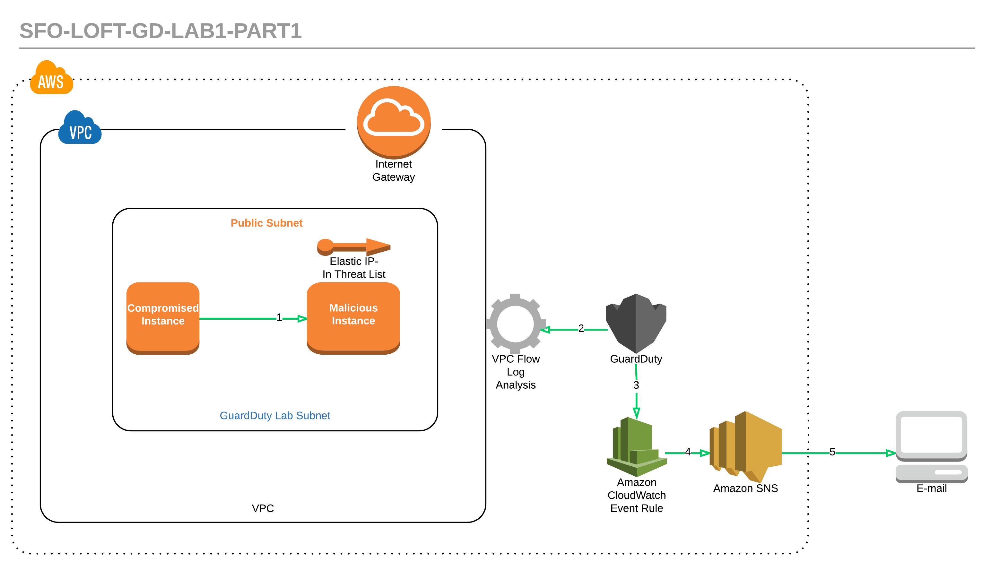
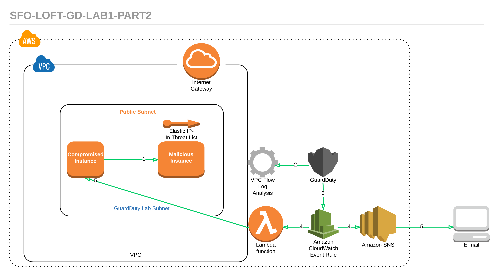
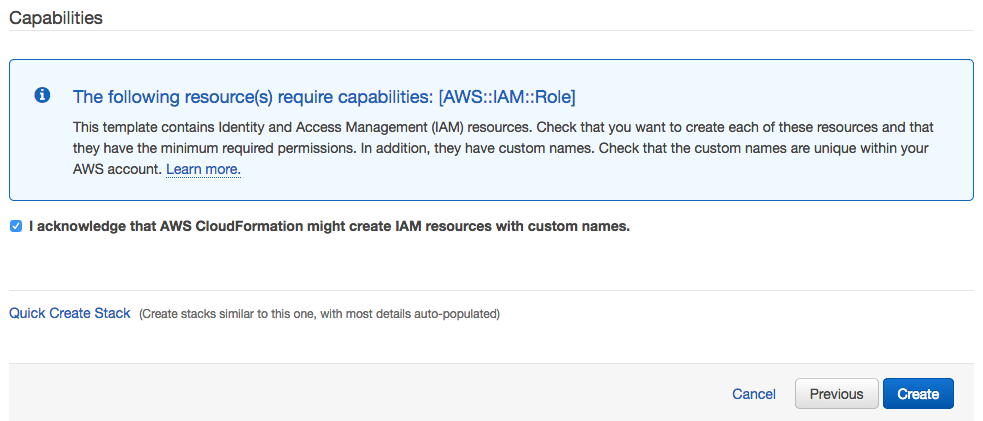

# Amazon GuardDuty Lab

 SFO Loft 12/14/17 

## Agenda

1. Intro to GuardDuty & Demo - 20 min
2. Lab 1 – Discovery & Remediation – EC2 - 35 min 
3. Discussion - 10 min
4. Lab 2 – Discovery & Remediation – IAM - 35 min
5. Discussion - 10 min
6. Summary & Closing - 10 min

## Lab 1 - Discovery and Remediation - EC2

### Part 1 - ***Discovery***

**Part 1 Summary:** You will enable GuardDuty and create a custom threat list. You will then launch a CloudFormation template. The CloudFormation template will create two EC2 instances. One instance (named **Malicious Instance**) will have the EIP you created attached to it. The other (named **Compromised Instance**) will continuously ping the **Malicious Instance** in order to generate GuardDuty findings. The scenario is that the **Compromised Instance** is under control by a 3rd party and is making calls to a malicious endpoint. The CloudFormation template also creates an SNS Topic to send you alerts (to the e-mail address you configured). Lastly the CloudFormation template creates a CloudWatch Event rule that trigger the SNS Topic when a GuardDuty finding occurs. It's the combination of GuardDuty, CloudWatch Events and SNS that e-mail you when GuardDuty creates a finding. 

### Enable GuardDuty
The first step is to enable Amazon GuardDuty. Browse to Amazon GuardDuty in the Amazon Console or click this [link](https://us-west-2.console.aws.amazon.com/guardduty/home?region=us-west-2). We will be using the Oregon (us-west-2) region for this lab so make sure that **Oregon** is selected in the upper right hand corner of the AWS Console. 

1. Once your are in the GuardDuty console, Click the  button. 
2. On the next screen click the  button.
3. That is all that is required to enable GuardDuty. 

### Request an EIP
1. Open the [Amazon EC2 console](https://console.aws.amazon.com/ec2/).
2. In the navigation pane, click **Elastic IPs**
3. Click **Allocate new address**
4. Make sure the radio button is set to **VPC** (you may not see this option depending on how old your AWS Account is - which determine whether you have access to EC2 Classic.) If you don't see this option then don't worry.
5. Click **Allocate**
6. Click on the Elastic IP address you just created on the next screen
7. Copy down the **Elastic IP** and the **allocation id**

### Create a new text file with your custom threat list
1. Copy the EIP you created in the previous step into a text file (**use a file name with no spaces - only put the EIP in the file**)
2. Open the [Amazon S3 console](https://s3.console.aws.amazon.com/s3/home?region=us-west-2).
2. Click **+ Create bucket** to create a new bucket - name it something unique since buckets names must be globally unique. Make sure the region is set to **US West (Oregon)** then click the **Create** button in the bottom left corner of the window. 
3. Click on the bucket then click **Upload** and upload the text file you created and copy down the URL of the file (which is available in the **link** section after you upload the file and then click on it.)

### Create a new GuardDuty ThreatList
1. Open the [GuardDuty console](https://console.aws.amazon.com/guardduty)
2. In the navigation pane, under **Settings**, choose **Lists**
3. On the **List management** page, choose **Add a threat list**
4. In the dialog box, do the following:
	* For List name, type a name for the list.
	* For Location, specify the URL of the file you uploaded to S3 in the previous step (format should be similar to https://s3.amazonaws.com/bucket_name/file.txt - this is the S3 location where you uploaded your custom threat list)
	* For Format, select **plaintext**
	* Select the **I agree** check box
	* Click **Add list**
5. This should take you back to the console, then click the box next to the word **Active** to make the threat list active. Click on another tab in GuardDuty and then back to the **Lists** tab to make sure the new threat list shows as active. 

### Request an EC2 Key Pair (if you don't currently have one)
1. If you don't currently have a EC2 Key Pair you will need to create one. Go to the [EC2 console](https://console.aws.amazon.com/ec2/). Under **Network & Security** click on **Key Pairs**. If you don't see a Key Pair there you will need to create one. Click on **Create Key Pair**. Give it a name and click **Create**

### Run the CloudFormation Template
1.  To run the CloudFormation template click **[this link](https://console.aws.amazon.com/cloudformation/home?region=us-west-2#cstack=sn%7ESFO-Loft-GuardDuty-Lab1-Part1%7Cturl%7Ehttps://s3-us-west-2.amazonaws.com/loftlab.gregmcconnel.net/gd-lab/sfo-loft-guardduty-lab1-part1.yml)**. This will automatically take you to the console to run the template. The file for the CloudFormation template **(sfo-loft-guardduty-lab1-part1.yml)** is in the root of the **Lab1-Discovery-and-Remediation-EC2** directory in the folder from the zip file you downloaded and expanded if you want to run the template manually. 
2. You will need to enter a number of parameters at the beginning. Below is an example:

3. Once you have entered your parameters click **Next**, then **Next** again (leave everything on this page at the default), then click **Create**
4. You will get an email from SNS asking you to confirm the Subscription. Confirm this so you can receive the email alert from GuardDuty for the finding the CloudFormation template will generate. 

### View GuardDuty Findings and the e-mail alerts from SNS
1. Check your email (the email account for the email address you entered in the CloudFormation parameters). You should have an email asking you to subscribe to the topic.
2. Then go back to the GuardDuty console and after about 10 minutes you should see a new finding .
3. Soon after the finding shows up in the GuardDuty console you should receive an email regarding the finding (the text of the email will be a little different from the finding - the CloudWatch Event Rule trigger for SNS is set to transform the message to make it more user friendly.) 

### Questions
1. What severity is the alert?
2. What two instances are implicated?
3. What has occurred?
4. What can we conclude about the instance named **Compromised**

### After you have answered the questions, delete the CloudFormation stack from the first part of Lab 1. 
1. Open the [CloudFormation console](https://us-west-2.console.aws.amazon.com/cloudformation/home?region=us-west-2#/stacks?filter=active)
2. Click the check box next to the stack created for this lab, then click **Actions** and click **Delete Stack** 

---

### Part 2 - ***Remediation*** 

**Part 2 Summary:** We will now use a pair of Lambda functions to remediate the compromised instance. Since GuardDuty has identified a potentially compromised instance, let's isolate the instance. We are going to assume the instance is compromised based on the finding but normally of course you would take investigative steps first.

We will use a CloudWatch Event that will get invoked off the GuardDuty finding and then trigger a Lambda function (which then calls a second Lambda function.) The second Lambda function will remove the instance from it's current Security Group and add it to one with no ingress or egress rules (effectively isolating the instance.) 

### Run the second CloudFormation script
1. To run the CloudFormation template click [this link](https://console.aws.amazon.com/cloudformation/home?region=us-west-2#cstack=sn%7ESFO-Loft-GuardDuty-Lab1-Part2%7Cturl%7Ehttps://s3-us-west-2.amazonaws.com/loftlab.gregmcconnel.net/gd-lab/sfo-loft-guardduty-lab1-part2.yml). This will automatically take you to the console to run the template. The file for the CloudFormation template **(sfo-loft-guardduty-lab1-part2.yml)** is in the root of the **Lab1-Discovery-and-Remediation-EC2** directory in the folder from the zip file you downloaded and expanded if you want to run the template manually. 
2. Like in Part 1, you will need to enter a number of parameters at the beginning. Below is an example:

3. Once you have entered your parameters click **Next**, then **Next** again on the **Options** screen (leave everything on this page at the default). On the **Review** screen check the Capabilities checkbox as shown below and click **Create**.

4. You will again get an email from SNS asking you to confirm the Subscription. Confirm this so you can receive the email alert from GuardDuty for the finding the CloudFormation template will generate. 

### View the current security group that the **Compromised Instance** is using
1. Go to the EC2 console
2. Find the **Compromised Instance** and check which security group it's using
3. Check back on this instance after you receive the email about the GuardDuty finding

### View GuardDuty Findings and the e-mail alerts from SNS
1. Check your email (the email account for the email address you entered in the CloudFormation parameters). You should have an email asking you to subscribe to the topic.
2. Then go back to the GuardDuty console and after about 10 minutes you should see a new finding.
3. Soon after the finding shows up in the GuardDuty console you should receive an email regarding the finding (the text of the email will be a little different from the finding - the CloudWatch Event Rule trigger for SNS is set to transform the message to make it more user friendly.) 

### Questions
1. What was the process for the security group of the **Compromised Instance** changing?
2. Does the security group truly isolate the instance?
3. What other steps could you configure Lambda to take before and after isolating the instance
4. In what situations would you not want to take action on an instance that appears to be compromised
5. What is the threshold of GuardDuty findings before you would consider taking a step to remediate the instance?

### Part 2 Cleanup
1. You will need to remove the **Compromised Instance** from the **Forensics Security Group** and add it back to the **Target Security Group** (which will be named something slightly different in your account since the name will be preceded by the name you used for the CloudFormation stack.) This can be done from [EC2 console](https://us-west-2.console.aws.amazon.com/ec2/v2/home?region=us-west-2#). Go to the Instances and find the  **Compromised Instance** and click **Actions**, **Networking** and finally **Change Security Groups**
2. Then delete the **Forensics Security Group**. This can also be done from the [EC2 console](https://us-west-2.console.aws.amazon.com/ec2/v2/home?region=us-west-2#) under **Security Groups**.
2. Now delete the CloudFormation stack to remove all of the resources created. Open the [CloudFormation console](https://us-west-2.console.aws.amazon.com/cloudformation/home?region=us-west-2#/stacks?filter=active)
3. Click the check box next to the stack created for this lab, then click **Actions** and click **Delete Stack** 
---

#### "Extra credit"
If you are interested in taking this further you could configure the Lambda function to also take a snapshot of the EBS volume and possibly stop the instance. 

#### FYI - Remediating a Compromised EC2 Instance
Here are some steps to consider when investigating and/or remediating a compromised EC2 instance in your AWS environment:

1. Investigate the instance for malware and remove any discovered malware. You can also refer to the AWS Marketplace for partner products that might help to identify and remove malware.
2. If you are unable to identify and stop unauthorized activity on your EC2 instance, we recommend that you take one of the following actions:
	* Terminate the compromised EC2 instance and replace it with a new instance as needed. 
	* Isolate the instance by removing ingress and egress rules from the security group
3. The following are additional resources for securing your EC2 instances:
	* "Security and Network" section in Best Practices for Amazon EC2.
	* Amazon EC2 Security Groups for Linux Instances and Amazon EC2 Security Groups for Windows Instances.
	* Tips for securing your EC2 instances (Linux) and Securing Windows EC2 Instances.
	* AWS Security Best Practices

